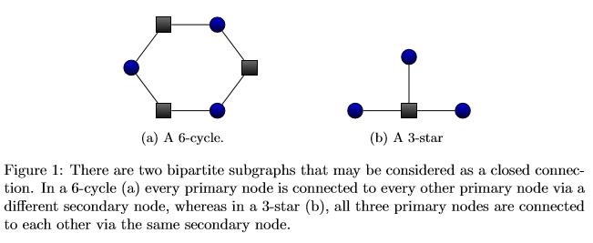
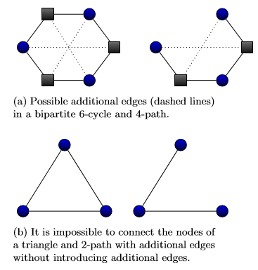
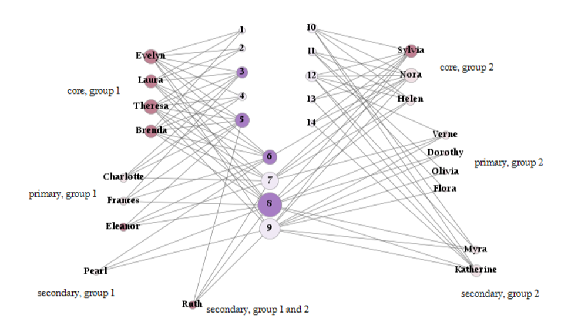
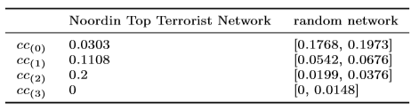

### 个人信息：

姓名：肖舒文

学号：21721140

主题：复杂网络

### 论文选择：

[Identifying Influential Nodes in Bipartite Networks Using the Clustering Coeffcient](https://arxiv.org/pdf/1406.5814.pdf)

#### 摘要：

The identification of influential nodes in complex network can be very challenging. If the network has a community structure, centrality measures may fail to identify the complete set of influential nodes, as the hubs and other central nodes of the network may lie inside only one community. Here we define a bipartite clustering coefficient that, by taking differently structured clusters into account, can find important nodes across communities.

### 论文解读：

#### 中心思想：

在网络中定位重要节点通常是至关重要的。然而目前许多中心性的措施无法很好地解决这个问题，特别是当网络是社区结构的时候。原因在于这些方法往往只会找出同一个社区内重要节点。因此文章提出了一种新的方法，基于新定义的聚类系数来确定跨社区的重要节点。文章主要聚焦在现实世界中比较常见的二分图结构的网络，这种网络的定义是可以把网络中的节点分成两个集合，其中节点的链接只存在于两个非同一集合的节点之间。如现实中的协作网络，作者部分通常只和论文部分有链接。在文章中，作者在二分图网络中进行计算，分析确定一个聚类系数，从而识别出驱动网络集群行为的重要节点。

#### 方法证明推导：

大部分的二分图网络的聚类系数都是测量四边形的浓度。这和普通的聚类系数有区别，因为普通的聚类系数是在单模图上计算的，因此三角形是它的最小圈。而二分图网络的最小圈是四个节点组成的。二分图的四节点循环圈是指二分图两个集合中各有两个点，他们之间存在链接，因此有四条路径。其聚类系数定义是闭合四节点圈在四节点圈中的占比。对于节点i的聚类系数定义是以节点i为中心的四节点路径中闭合的路径的占比。如图一所示，分别是一个六节点圈和四节点的星型路径，分别都是闭合的。

对于一个六节点圈而言，如果加入了额外路径，那么则会有更多的形态，如图2所示。

为了能够更好地区分这些形态，作者引入了崭新的聚类系数的计算方法。他们为图2的四种六节点圈的结构各提出了一种新的聚类系数。

对于无连接的六节点图（unconnected 6-cycle），它对应的无连接聚类系数定义如下：

其中是构成6节点圈的闭合4路径的数目，是4路径的总数目。

对于稀疏连接的六节点图（sparsely connected 6-cycle），其对应的聚类系数定义是：

对于高度连接的六节点图（highly connected 6-cycle），其对应的聚类系数定义如下：

对于全连接的六节点图（completely connected 6-cycle），其对应的聚类系数定义如下：

#### 实验结果：

作者在南方妇女网络数据集（southern women network）上进行实验。这个数据集包含了18名女性和14种事件。南部妇女数据集的第一次分析由Davis、Gardner和Gardner Davis等人进行。以访谈的形式，目的是将18名妇女分为不同的群体。他们发现了两个不同的群体，进一步分为核心成员、初级成员和次级成员。图3显示了两个群体的南方女性网络。作者的分析发现所有核心女性都具有影响力，第二组的核心女性也相同。同时提出的方法得到的模型也指出了重要的成员，即找到了网络中的重要的节点。

作者在另一个数据集上也进行了实验。该数据集是丁顶级恐怖网络埃弗顿数据集的一个子集。这个子集模拟了26名恐怖分子网络成员在20次不同会议上的出席情况。该子集包含成员和会议之间总共64个连接。表1显示了恐怖集团成员的聚集系数。

可以看到随着聚类效率的提升，模型所处的置信区间的置信率越来越高。

#### 结论和未来工作

为了分析两分图网络，如果简单地使用单模结构的算法来解决，得到的效果往往不太好。文章提出的聚类系数，能够更好地解决这个问题。从而实现在网络中找到重要的节点这个任务。
