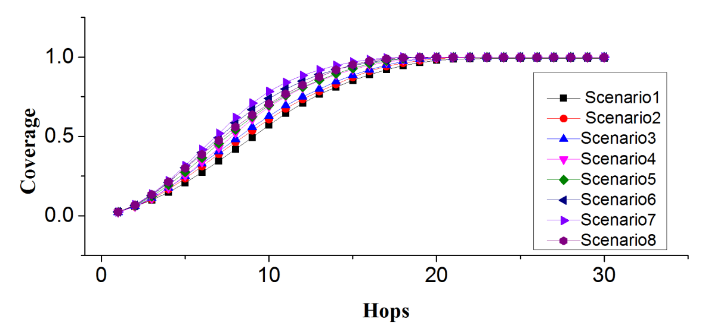
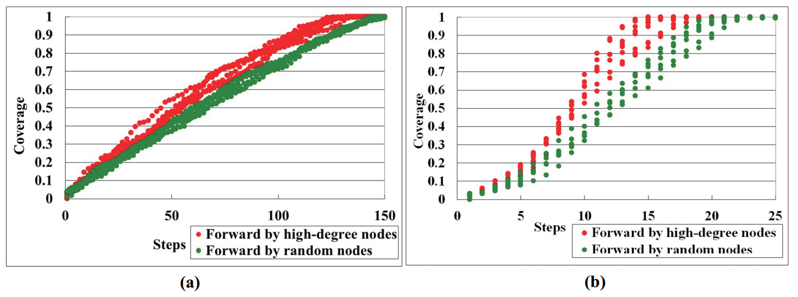
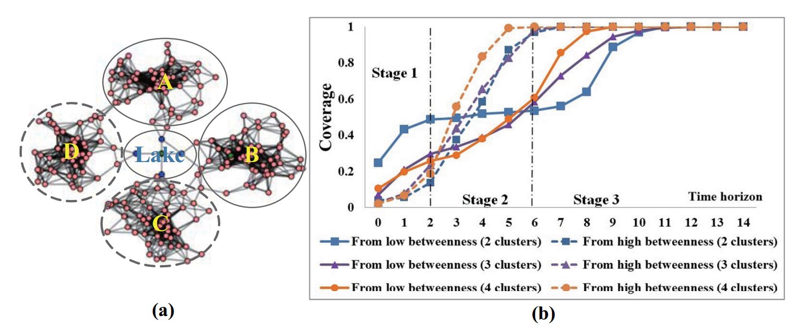
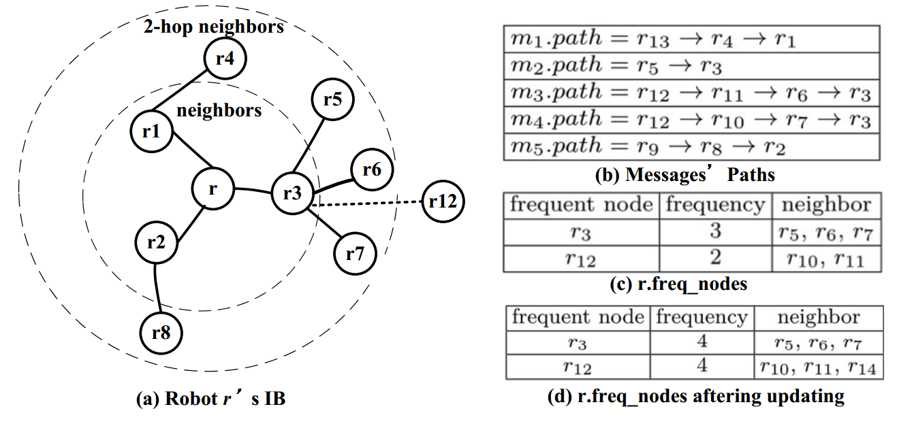
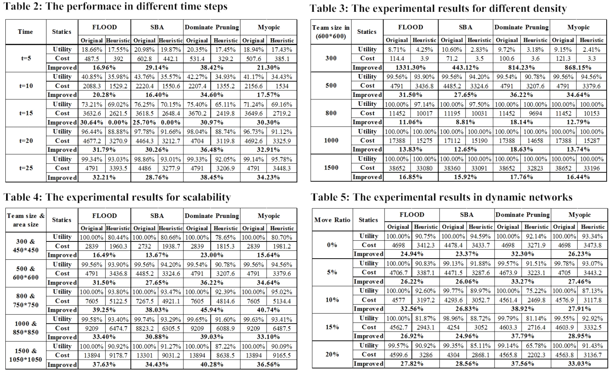
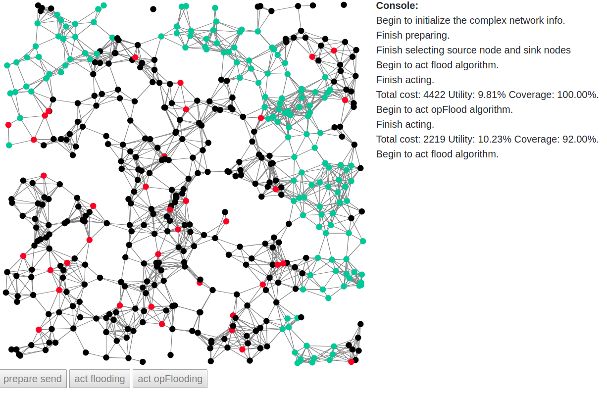
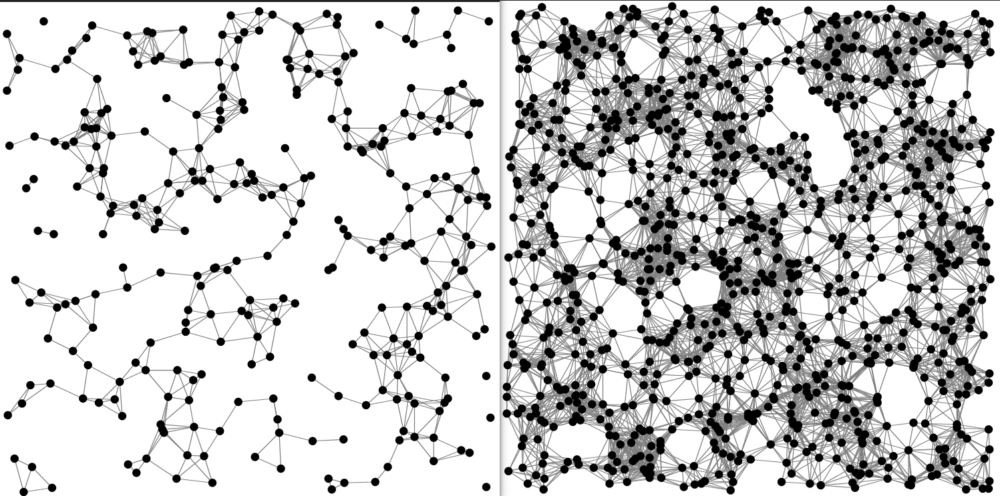

### 个人信息
- 姓名：张苏
- 学号：21821257
- 主题：复杂网络（Complex Networks）
- 邮箱：zhangsu7133@qq.com

### 选择论文

[Using Complex Network Effects for Communication Decisions in Large Multi-robot Teams](https://dl.acm.org/citation.cfm?id=2615731.2615842)

* **Abstract**
> Sharing information is critical to multi-robot team coordination when robots are widely deployed in a dynamic and partially observable environment. To be efficient, robots should balance well between broadcasting information and reserving limited bandwidth so that only the right information should be broadcast to the interested receivers. Robots’ communication decision is normally modeled as a multiagent decision theoretical problem. However, when the team expands to very large, the solution is classified as NEXPCOMPLETE. In this paper, in addition to building heuristic approaches to solve the decision theoretical problem based on the information context to be broadcast, we put forward a novel context-free decision model that allows fast communication decision by considering complex network attributes in large teams. Similar to human society, information should be broadcast if the action can make a good information coverage in the team. We analyze how complex network attributes can improve communication in a broadcast network. By putting forward a heuristic model to estimate those complex network attributes from robots’ local view, we can build decision models either from robots’ experiences or from their local incoming communications. Finally, we incorporate our algorithm in well-known information sharing algorithms and the results manifest the feasibility of our design.

* **摘要**
> 当机器人广泛部署在动态和部分可观察的环境中时，共享信息对于多机器人团队协调至关重要。为了提高效率，机器人应该在广播信息和保留有限带宽之间保持平衡，以保证只有正确的信息才能被广播给感兴趣的接收者。机器人的通信决策通常被建模为多智能体决策理论问题。但是，当团队扩展到非常大时，解决方案被归类为NEXPCOMPLETE。在本文中，除了构建基于需要广播的信息上下文来解决决策理论问题的启发式方法之外，我们还提出了一种新的无上下文决策模型，通过考虑大型团队中的复杂网络属性来实现快速通信决策。与人类社会类似，如果行动可以在团队中实现良好的信息覆盖，则应当广播信息。我们分析了复杂网络属性如何改善广播网络中的通信。通过提出一个启发式模型来估计机器人本地视图中的复杂网络属性，我们可以根据机器人的经验或本地传入的通信建立决策模型。最后，我们将算法结合到众所周知的信息共享算法中，结果证明了我们设计的可行性。

### 精读论文

本文主要针对问题为信息共享，应用场景为大型多机器人团队中的通信决策。论文结合复杂网络的部分性质，为参与通信的机器人个体构建了启发式模型为其评估本地视角下的复杂网络属性，并为通信决策提出了一种构建启发式算法的方法。

论文首先分析了复杂网络属性与信息共享的关联性。下图反映了多机器人所构成的复杂网络中平均距离对于信息共享达到一定覆盖率(Coverage)的总跳(hop)数的影响。简单分析可以发现，需要达到 90% 以上的覆盖率，所需的跳数约为平均距离的两倍。

同时，论文对于复杂网络中度的分布(Degree distribution)同样做了实验研究，其结果如下图所示。可以直观看到，通过高 degree 节点进行信息广播可以凭借较少的跳数获得较高的信息覆盖率，从而证明了高频节点对于提升信息共享效率的价值。

此外，论文还继续探究了集群和中介中间性(Clustering and betweenness centrality)对于信息共享效率的影响。如下图(a)所示，网络中可能由于地理条件影响构成集群，并存在连接多个集群的关键节点。下图(b)中显示了这一集群效应对于信息共享效率的影响，说明了高频中介能够有效提升信息共享效率。

针对于上述探究结果，论文为复杂网络中的机器人节点构建的网络属性模型：<r.avg_dist, r.degree_distribution, r.freq_nodes>，分别代表网络的平均距离、度的分布以及高频节点。由于单个节点无法获取整个网络的属性信息，其模型构建以及更新均为局部的，依赖于先前已收到的消息。因此，所有已接受的消息被储存在节点的IB(Information base)中，并结合后续接受的消息，计算得到局部网络属性。其模型以及简单的更新如下图所示：

基于已构建的局部网络模型，节点可以对每次收到的消息进行决策从而确定是否对其进行重新广播。其算法流程如下：
 1. 通过网络平均距离计算消息跳数阈值；
 2. 搜索邻居节点中未接受消息的节点，计算其 degree 数从而衡量其权重；
 3. 选择 M 个高频节点，并找到其中已经接受消息的节点，以及连接到这些高频节点的邻居节点中已被覆盖的节点，通过删除这些已覆盖的高频节点，可以计算出邻居节点中连接到潜在未覆盖高频节点的数量；
 4. 结合上述三步的计算结果，并结合预设的权重，可以计算出最终的广播概率，通过抽奖算法得到是否对该消息进行重新广播的决策结果。

使用该启发式算法可以对传统的信息共享算法进行一定的优化，包括：Flood、SBA、Dominate Pruning、Myopic 等。其算法的优化结果如下所示：

### 复现论文

为了使得论文中所提到的启发性算法的效果得到可视化的展示，在论文复现环节采用了 Web 的方式对多机器人团队执行通信决策的过程进行了模拟。
实现代码中使用了 JavaScript 进行开发，并在画布上通过动画的方式展现了多机器人以及信息在多机器人之间进行传递的过程。

由于 JavaScript 对于多线程的支持较为贫乏，同时考虑仿真器的具体性能，因此在具体的实现过程中添加了一条额外的假设，也即是在节点之间通信所需要的传输时间相等。根据这一假设，可以在同一个时刻处理所有自上一节点传递到下一节点的信息。根据实际执行效果的检验，这一假设对仿真结果的影响较小。

仿真效果如下所示：

具体的实现代码存放在 code 文件夹中。

### 完成实验

实验的主要目的为验证论文所提出的启发式算法对于信息传递效率的提升。实验所设定的场景与论文相同，均是限定区域内多机器人之间的信息传递。实验主要探究在不同网络稠密度下，相关算法的执行结果以及效率。

与论文中所设定的条件相类似，实验将场景限制在 600×600 的区域范围内，并改变区域内的机器人节点数量也即是机器人所构成的复杂网络的稠密度，从而探究不同稠密度下启发式算法的执行效率。
实验中机器人节点的数量从 300 增加到 1000，下图显示了一个前后两者分别所构成的网络情况：

实验中根据不同的网络稠密度进行多次实验，从而计算得到最终的算法执行效率。对于实验结果的分析主要根据两个指标进行：Utility 和 Cost。其中，Utility 指的是在算法执行结束后，已收到消息的目标节点所占全部目标节点的比例。Cost 指的是信息传播所付出的代价，每一次信息传播均会产生发送以及接受消息的代价，并累加到整体信息传递代价中去。
此外，为了更好的衡量算法整体的效率提升，在 Utility 以及 Cost 两个指标以外，还使用了论文中所提出的 Improved 指标，其计算公式为： (Utility_H/Utility_O)/(Cost_H/Cost_O) - 1 。Improved 指标结合了 Utility 和 Cost 并得到一个整体的算法效率提升比例。

相应的数据结果如下所示：

根据实验结果可以看出，论文中所提出的启发式算法对于算法执行效率的确有较大的优化。这一优化主要体现在对 Cost 的降低上。启发式算法在网络稠密度较高的场景下表现较为出色，在 Utility 以及 Cost 两个指标上均有所提升。

但是同时也必须看到的是，在网络稠密度较低的情况下，启发式算法所达到的节点覆盖率不足，甚至远低于传统算法的执行结果。这一问题也对启发式算法的执行结果可靠性提出了质疑。

### 结论

根据实验的数据，我们可以得出一些结论：
 - 论文所提出的启发式算法在一定程度上对传统信息传递算法的执行效率有所提升，这一提升集中体现在对 Cost 的降低上，也即是该启发式算法可以有效的节约信息传递所消耗的带宽资源；
 - 在网络稠密度较低的情况下，该启发式算法所达到的 Utility 较不理想，这使得其信息传递的结果更不可靠。

分析论文所提算法的思想，其仍存在两点缺陷：
 - 论文所提出的启发式算法依赖于一定的先验条件，即网络内部之前发送消息所记录的局部网络数据，这一先验条件直接影响后续算法的执行效果，因此在与传统算法进行横向比较时，如何设定先验条件，以及其对后续算法执行结果的影响范围，在论文中并未涉及；
 - 论文中所提出的算法在网络稠密度较低的情况下表现较少，体现在 Utility 较低。同时，论文所基于的假设：使得网络内部 90% 以上节点覆盖所需跳数为平均 degree 的两倍，仅仅是根据少量的实验所得出的结论，并没有可靠的理论依据。

