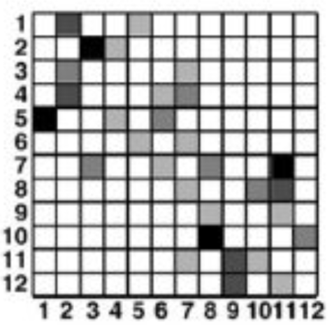
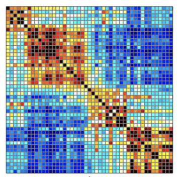
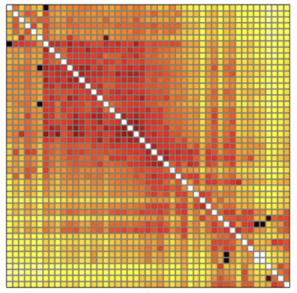
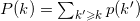
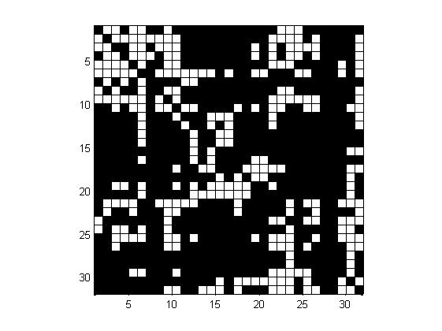
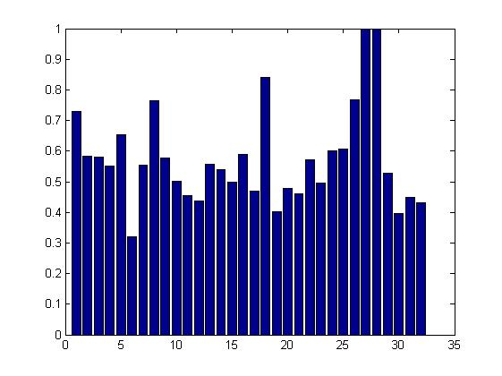
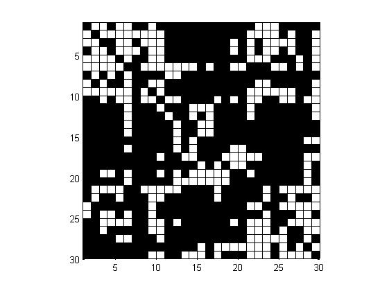

# 个人信息
- 姓名：戴青锋
- 学号：11621022
- 主题：复杂网络（Complex Networks）
- 邮箱：qfdai@zju.edu.cn

# 论文选择

[Complex network measures of brain connectivity: Uses and interpretations](https://sph.umd.edu/sites/default/files/files/Rubinov_Sporns_2009.pdf)

- 摘要

Brain connectivity datasets comprise networks of brain regions connected by anatomical tracts or by
functional associations. Complex network analysis—a new multidisciplinary approach to the study of
complex systems—aims to characterize these brain networks with a small number of neurobiologically
meaningful and easily computable measures. In this article, we discuss construction of brain networks from
connectivity data and describe the most commonly used network measures of structural and functional
connectivity. We describe measures that variously detect functional integration and segregation, quantify
centrality of individual brain regions or pathways, characterize patterns of local anatomical circuitry, and test
resilience of networks to insult. We discuss the issues surrounding comparison of structural and functional
network connectivity, as well as comparison of networks across subjects. Finally, we describe a Matlab
toolbox (http://www.brain-connectivity-toolbox.net) accompanying this article and containing a collection
of complex network measures and large-scale neuroanatomical connectivity datasets.

# 论文解读
论文主要的研究内容为，从脑部结构出发分析其脑复杂网络的构建方式和网络的功能。例如其中很常见的表示方法，
将不同的脑部区域当作是不同的节点，节点的连线即为边，在脑网络结构中这些边可以代表3种含义。
一是解剖学意义上的连接，其含义是物理意义上的连接，即两个节点在脑中是紧挨着的区域；二是
功能性的连接, 其含义是医学上的连接意义，即激活某个节点会使得网络中相连的节点也被激活；
三是有效性连接，其含义是指节点之间的因果关系，即由某个节点指向另一个节点，其之间存在着先后关系，这就
意味着脑网络的图结构是一个有向图。

一般而言，脑复杂网络的表示方法为方阵（行、列的数量一致），其中行和列表示的是节点的数量，而矩阵的元素Mij代表的是节点i和节点j之间的连接强度（或相关性、因果性）。如下图所示,其表示的是一个包含12个节点的脑网络，从图中可以看到的是节点11到节点12之间是有连接的，但是节点12到节点11之间并没有连接，这说明该网络是个有向的网络。

除此之外，还有功能性无向网络，如下图所示，可以看到的是该矩阵是对称的，即不管节点的顺序如何，两者之间的权重
大小是相同的。其中暖色调的颜色表示的是正向的关联性，即前一节点会正向刺激后一节点；冷色调的颜色表示的是反向的
关联性，即前一节点会抑制后一节点。

最后是有效性有向网络，如下图所示。该网络的矩阵表示是个非对称的矩阵，其在(i,j)处的权值的计算方式为将信息从节点i
转移到j的信息熵的变化，因此Mij和Mji对应的权重是不同的。

在构建好网络后需要对此网络进行评估分析，但是直接从上述表示中很难获得直接有效的复杂网络信息，因此文章给出了一些测度（Measures）用于表示
复杂网络的特征，下面是文章中给出的一些复杂网络测度。虽然这些测度是针对于脑网络的，但是仍然可以扩展到其他类型的复杂网络，例如社交网络等。

- 基本的概念与记号：N表示复杂网络中所有节点的集合，n代表的是集合N中包含的节点数量；L表示复杂网络中所有连接的集合，l代表的是集合L中包含的连接个数；（i,j）记为节点i，j之间的连接，其中i,j属于集合N；aij表示的是i，j之间的连接状态，1表示存在着连接，0则表示不存在连接，这是0-1无向定义；若认为连接值在0～1之间，那么将其记作wij，且wij在0，1之间。
- 常用的测度：节点的度（Degree），节点i和j之间最短路径距离(Shortest path distance)，三角形数（Number of trianles），特征路径长度（Characteristic path length），全局效率(Global Efficiency)，聚类悉数（Clustering Coefficient），传递性(Transivity)，局部效率(Local Efficiency),模块化性能（Modularity），中心化程度(Closeness centraity),中介中心化程度(betweeness centrality)，模块内节点度(Within-module degree z-score)，参与系数(Participation coeffecient)，网络主题(Network motifs),主题z-score系数(Motif z-score),主题指纹(Motif fingerprint)，分布度(Degree Distribution)，平均邻度(Average Neighbor Degree)，同类性系数(Assortativity coefficient)

为了分析复杂网络的功能与特性，可以使用上述测度对网络进行评测。例如评估复杂网络的弹性，可以通过分布度(Degree Distribution)来评估网络的弹性。具有幂律度分布的复杂网络可能对逐渐随机恶化具有弹性，但很容易受到高度中心节点的破坏。大多数现实生活中的网络都没有完美的幂律度分布。另一方面，许多网络具有局部表现为幂律的度分布。其中分布度的计算方式如下所示：

其中P(k')是该节点的度为k'的概览。此外Average Neighbot Degree和 Assortativity coefficient都可以用于评估网络的弹性，不过与分布度考虑的角度不同。

# 论文复现
文章提供了一个Matlab的脑连接性分析工具，基于此做了一些对于复杂网络分析的实验，代码见src

# 可视化分析
首先我们可视化连接矩阵，其对应的图像如下所示，其包含了32个节点，故连接矩阵的维度是32*32，图中白色的点对应的是存在的连接，黑色的对应的是不存在的连接。

我们首先分析了每个节点的度，其结果如下表所示

节点|1|2|3|4|5|6|7|8|9|10|11|12|13|14|15|16
 :-- | :-- | :-- | :-- | :-- | :-- | :-- | :-- | :--|:-- | :-- | :-- | :-- | :-- | :-- | :-- | :-- | :--
度|8|9|13|9|11|19|2|6|15|16|5|11|5|10|9|7

节点|17|18|19|20|21|22|23|24|25|26|27|28|29|30|31|32
:-- | :-- | :-- | :-- | :-- | :-- | :-- | :-- | :--|:-- | :-- | :-- | :-- | :-- | :-- | :-- | :-- | :--
度|9|5|10|6|16|13|17|7|10|10|0|0|9|16|19|13

节点6的度最大为19，节点27和28的度最小为0（意味着没有连接）。然后我们分析了每个节点的聚类情况，用聚类系数了评测该性能，得到的结果如下图所示，与度数的分布结果相类似，节点27和28的聚类效应最为明显，节点6则最弱。

为了对不同的复杂网络进行对比，我们对30*30的连接矩阵也进行了分析，其连接矩阵如下所示

我们计算了两个网络的Transitivity，得到的结果分别为0.4945(30x30)和0.4883(32x32)，可以看到的是节点数越少网络的传递性就越好，这也和实际的情况相符合。

同样地，我们计算了两个网络的同类性系数(Assortativity)，30x30的网络同类性系数为-0.0735，而32x32的同类性网络洗漱为-0.1061，节点数越多同类性的概率就越低。

# 总结
该文章更多的是一种综述性质的讲解，主要分析和研究了复杂网络的构造以及其相关测度的计算和使用，但是其应用层面上还不够具体实际，例如从脑部的MRI图构建出大规模的连接矩阵用于分析脑部的功能或者诊断，这是需要进一步研究和实现的。

